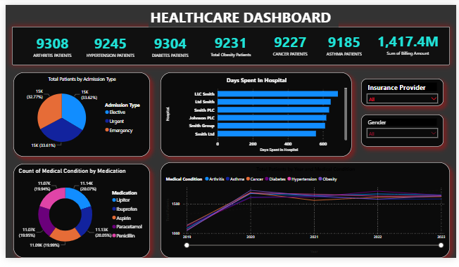

# HealthCare-Dashboard

### **About Dataset:**

This healthcare dataset comprises detailed records of patients admitted to various hospitals, capturing critical aspects of their medical care and administrative data. Each record includes demographic information such as the patient's name, age, and gender, along with crucial medical details like blood type, primary medical condition, and medications administered. The dataset also contains logistical and administrative data such as the date of admission, the attending doctor, hospital name, room number, and the type of admission, which categorizes the urgency of each case as Urgent, Emergency, or Elective.

The dataset compromises the following columns: 

- **Name:** The full name of the patient admitted to the hospital.
- **Age:** The age of the patient at the time of admission.
- **Gender:** The gender identity of the patient (e.g., Male, Female).
- **Blood Type:** The blood type of the patient, important for transfusions and other medical procedures.
- **Medical Condition:** The primary medical condition or diagnosis for which the patient is being treated.
- **Date of Admission:** The date on which the patient was admitted to the hospital.
- **Doctor:** The name of the doctor or healthcare professional primarily responsible for the patient.
- **Hospital:** The name of the hospital where the patient is receiving treatment.
- **Insurance Provider:** The name of the company providing health insurance coverage for the patient.
- **Billing Amount:** The total amount billed for the hospital stay and treatment.
- **Room Number:** The room number where the patient is lodged during their hospital stay.
- **Admission Type:** The type of admission (e.g., Urgent, Emergency, Elective), indicating the urgency of the situation.
- **Discharge Date:** The date on which the patient was discharged from the hospital.
- **Medication:** Any significant medications prescribed during the hospital stay.
- **Test Results:** Outcomes of key medical tests conducted, usually categorized as Normal, Abnormal, or Inconclusive.

[DataSet- Kaggle](https://www.kaggle.com/datasets/prasad22/healthcare-dataset)

### **KPI’s**   

In this report, I have created the following KPIs.
1. **Total Arthritis Patients** = CALCULATE(
    COUNTROWS('healthcare_dataset'),
    'healthcare_dataset'[Medical Condition] = "Arthritis"
)
2. **Total Asthma Patients**= CALCULATE(
    COUNTROWS('healthcare_dataset'),
    'healthcare_dataset'[Medical Condition] = "Asthma"
)
3. **Total Cancer Patients** = CALCULATE(
    COUNTROWS('healthcare_dataset'),
    'healthcare_dataset'[Medical Condition] = "Cancer"
)
4. **Total Diabetes Patients** = CALCULATE(
    COUNTROWS('healthcare_dataset'),
    'healthcare_dataset'[Medical Condition] = "Diabetes"
)
5. **Total Hypertension Patients** = CALCULATE(
    COUNTROWS('healthcare_dataset'),
    'healthcare_dataset'[Medical Condition] = "Hypertension"
)
6. **Total Obesity Patients** = CALCULATE(
    COUNTROWS('healthcare_dataset'),
    'healthcare_dataset'[Medical Condition] = "Obesity"
)
7. **Total Patients** = DISTINCTCOUNT('healthcare_dataset'[Name])

